<p align="center">
  
  
  
  
  
</p>

# March Madness Agent Swarm 2026

**8 AI agents debate every NCAA Tournament game in structured, multi-round deliberation. No single model decides alone.**

A multi-agent system where 7 specialist analysts and 1 conductor independently evaluate, cross-examine, and vote on all 63 tournament games. The system produces probabilistic predictions, full debate transcripts, upset detection scores, and market inefficiency reports &mdash; all for $26.84 in API costs.

<p align="center">
  <strong>
    <a href="https://2026-march-madness-eight.vercel.app">Live Dashboard</a>
    &nbsp;&middot;&nbsp;
    <a href="#the-agents">The Agents</a>
    &nbsp;&middot;&nbsp;
    <a href="#architecture">Architecture</a>
    &nbsp;&middot;&nbsp;
    <a href="#results">Results</a>
    &nbsp;&middot;&nbsp;
    <a href="#applications-beyond-sports">Enterprise Applications</a>
  </strong>
</p>

---

## Predicted Champion

```
                          CHAMPION
                       #1 Arizona 🏆
                     53% confidence (4-3)
                   over #5 Vanderbilt

   Final Four                           Final Four
   #1 Duke ──────┐               ┌────── #5 Vanderbilt
                  ├─ #1 Arizona ──┤
   #1 Arizona ───┘               └────── #1 Michigan

   Elite 8                               Elite 8
   Duke, Arizona                 Michigan, Vanderbilt
   (both via conductor override)  (Vandy 6-1 over Houston)
```

---

## The Agents

| | Agent | Specialty | Model | Personality | Position Changes |
|---|---|---|---|---|---|
| 🦅 | **Tempo Hawk** | Pace & Efficiency | Claude Sonnet 4 | The statistician who sees basketball as a game of possessions. Every matchup is a tempo equation. | 16 |
| 🛡️ | **Iron Curtain** | Defensive Zealot | Claude Sonnet 4 | Defense wins championships, and Iron Curtain will die on that hill. Dismisses offensive firepower as unreliable. | 14 |
| 💥 | **Glass Cannon** | Shooting Variance | Gemini 2.5 Flash | The hot-take artist who believes any team can win if their shooters get hot. Excitable, prone to dramatic flips. | 19 |
| 🐺 | **Road Dog** | Experience & Coaching | Gemini 2.5 Flash | Old-school scout who trusts veteran leadership over advanced metrics. Senior guards matter more than KenPom. | 17 |
| 👁️ | **Whisper** | Intel & Hidden Edges | Gemini 2.5 Flash | The conspiracy theorist of basketball analytics. Sees hidden factors everywhere &mdash; travel fatigue, injury ripple effects. | 25 |
| 📜 | **Oracle** | Historical Patterns | Claude Sonnet 4 | Every game has happened before. Matches current matchups to precedents since 1985. The professor of the panel. | 22 |
| 🔥 | **Streak** | Momentum & Form | Gemini 2.5 Flash | Forget the spreadsheets &mdash; what happened LAST WEEK matters more than season averages. | 17 |
| 🎼 | **The Conductor** | Final Decision | Claude Sonnet 4 | Synthesizes all arguments using weighted probability math. Can override the majority when the numbers disagree. | &mdash; |

**Multi-model design:** Claude agents (Tempo Hawk, Iron Curtain, Oracle) handle quantitative rigor. Gemini agents (Glass Cannon, Road Dog, Whisper, Streak) bring faster response times and different reasoning patterns. This prevents single-model groupthink at the architecture level.

---

## Architecture

```mermaid
flowchart TD
    subgraph R1["Round 1 — Independent Analysis"]
        direction LR
        TH["🦅 Tempo Hawk"]
        IC["🛡️ Iron Curtain"]
        GC["💥 Glass Cannon"]
        RD["🐺 Road Dog"]
        WH["👁️ Whisper"]
        OR["📜 Oracle"]
        ST["🔥 Streak"]
    end

    subgraph XA["Cross-Attention Layer"]
        direction TB
        R1S["R1 Summary: all 7 analyses visible to all agents"]
        R2["Round 2 — Cross-Examination"]
        R1S --> R2
    end

    subgraph R2D["Round 2 Outputs"]
        direction LR
        SC["Position Changes:<br/>strengthened / weakened / flipped / unchanged"]
        RB["Rebuttals:<br/>specific disagreements with named agents"]
        UP["Updated Probabilities:<br/>revised win% and uncertainty"]
    end

    subgraph DA["Anti-Convergence"]
        UCheck{"Unanimous<br/>7-0 vote?"}
        DAAgent["Devil's Advocate:<br/>forced contrarian argument"]
    end

    subgraph COND["The Conductor"]
        direction TB
        WP["Weighted Probability Combination"]
        OR2["Override Rules:<br/>6-1/7-0: must follow majority<br/>5-2: override only if both dissenters >75%<br/>4-3: independent judgment"]
        FP["Final Pick + Confidence + Dissent Report"]
        WP --> OR2 --> FP
    end

    subgraph POST["Post-Processing"]
        direction LR
        US["Upset Score<br/>(0-100)"]
        ME["Market Edge<br/>(vs Vegas)"]
        MC["Monte Carlo<br/>(10K sims)"]
    end

    R1 --> XA
    XA --> R2D
    R2D --> DA
    UCheck -->|Yes| DAAgent
    UCheck -->|No| COND
    DAAgent --> COND
    R2D --> COND
    COND --> POST
```



### Round 1: Independent Analysis

Each agent receives the same game context (team stats, injuries, seeds, odds) and independently produces:
- A **win probability** with uncertainty bounds (e.g., `Arizona 0.58 ± 0.15`)
- A **key stat** from their specialty lens
- A **quoted analysis** explaining their reasoning

Agents see only the raw data &mdash; never each other's Round 1 work. This ensures genuine diversity of opinion before cross-examination begins.

### Round 2: Cross-Examination

The cross-attention layer is the core innovation. All Round 1 analyses are compiled into a summary and fed to every agent simultaneously. Each agent must:

1. **Identify strongest disagreement** &mdash; name a specific agent, explain why they're wrong with one data point
2. **Identify strongest agreement** &mdash; name which agent reinforced their view
3. **Declare position change** &mdash; `strengthened`, `weakened`, `flipped`, or `unchanged`
4. **Update probability** &mdash; revised win% accounting for new arguments

Anti-groupthink rule: agents can't pile on the same target if 2+ others already attacked them. This forces diverse cross-examination.

### The Conductor

The Conductor sees both rounds and applies **feature-driven weighted averaging**:
- Agents whose specialty matches the game's dominant feature get 2x weight (e.g., Iron Curtain gets 2x when the defensive efficiency gap is >4 points)
- Agent accuracy history adjusts weights (70%+ accuracy &rarr; 1.5x, <40% &rarr; 0.5x)
- The same agent can't dominate consecutive games (0.5x penalty on previous game's most-weighted agent)

Override enforcement prevents the Conductor from overriding strong consensus:
- **6-1 or 7-0**: Must follow majority. No exceptions.
- **5-2**: Can only override if both dissenters have >75% confidence AND all majority members have <65%
- **4-3**: Independent judgment, with the relevant specialist weighted 2x

### Anti-Convergence

When all 7 agents vote unanimously, a **Devil's Advocate** is triggered. A randomly selected agent is forced to argue for the other team with a special prompt. The DA's confidence is halved and capped at 50%, but their arguments are included in the Conductor's deliberation. This happened in 13/63 games (21% groupthink rate).

---

## The Six Pillars

The system is built on six analytical pillars, each grounded in a specific codebase component:

| Pillar | What It Captures | Code | Key Mechanism |
|--------|-----------------|------|---------------|
| **Tournament Memory** | Agent self-awareness across games | [`agent_memory.py`](agent_memory.py) | Per-agent accuracy tracking, calibration history, flip quality scoring. Two modes: prediction (empty) and live-update (real results). |
| **Probabilistic Output** | Uncertainty quantification on every pick | [`swarm_engine.py`](swarm_engine.py) | Every agent outputs `probability ± uncertainty`. Combined via weighted averaging with disagreement-based uncertainty inflation. |
| **Budget Enforcement** | Cost control with prompt injection protection | [`cost_guard.py`](cost_guard.py) | Pre-flight cost estimation, warnings at 50/75/90% thresholds, team name sanitization against injection patterns. |
| **Market Analysis** | Swarm vs Vegas odds comparison | [`market_analyzer.py`](market_analyzer.py) | Edge decomposition by agent, contrarian agent identification, Kelly criterion position sizing with half-Kelly safety cap. |
| **Observability** | Full tracing and calibration | [`observability.py`](observability.py) | Per-game trace IDs, agent performance aggregation, Brier score, log loss, expected calibration error (ECE). |
| **Monte Carlo Simulation** | Championship probability estimation | [`monte_carlo.py`](monte_carlo.py) | 10,000 bracket simulations using R64 probabilities with seed-based and KenPom-adjusted transition probabilities for later rounds. |

---

## Results

### R64 Calibration

| Matchup | Upsets Called | Expected | Status |
|---------|-------------|----------|--------|
| 1 vs 16 | 0/4 | ~0 | OK |
| 2 vs 15 | 0/4 | ~0 | OK |
| 3 vs 14 | 0/4 | ~0 | OK |
| 4 vs 13 | 0/4 | ~1 | LOW |
| 5 vs 12 | 1/4 | ~1 | OK |
| 6 vs 11 | 3/4 | ~1-2 | OK |
| 7 vs 10 | 2/4 | ~1-2 | OK |
| 8 vs 9  | 2/4 | ~2 | OK |
| **Total** | **8/32** | **7-10** | **OK** |

8 R64 upsets called &mdash; within the historical expected range of 7-10.

### Cinderella Runs

| Team | Seed | Path | Deepest Round |
|------|------|------|---------------|
| **Vanderbilt** | #5 | McNeese &rarr; Nebraska &rarr; #1 Florida &rarr; #2 Houston &rarr; #1 Michigan &rarr; lost to #1 Arizona | Championship Game |
| **USF** | #11 | #6 Louisville (7-0) &rarr; #3 Michigan State &rarr; #7 UCLA &rarr; lost to #1 Duke | Elite 8 |
| **VCU** | #11 | #6 UNC (7-0, 64.4 upset score) &rarr; #3 Illinois &rarr; lost to #2 Houston | Sweet 16 |
| **Akron** | #12 | #5 Texas Tech (6-1) &rarr; #4 Alabama &rarr; lost to #1 Michigan | Sweet 16 |
| **Texas** | #11 | #6 BYU (override) &rarr; #3 Gonzaga &rarr; lost to #2 Purdue | Sweet 16 |

### Conductor Overrides

6 games where the Conductor picked against the majority vote:

| Game | Majority Pick | Conductor Pick | Key Factor |
|------|--------------|----------------|------------|
| BYU vs Texas (R64) | BYU (4-3) | **Texas** | Missing key scorer (Saunders injury) |
| Miami FL vs Missouri (R64) | Missouri (4-3) | **Miami FL** | Efficiency margin in pace-neutral game |
| Vanderbilt vs McNeese (R64) | McNeese (4-3) | **Vanderbilt** | Shooting disparity |
| Nebraska vs Troy (R64) | Troy (4-3) | **Nebraska** | Identical pace eliminates variance |
| Texas A&M vs Houston (R32) | Texas A&M (5-2) | **Houston** | Experience gap and momentum mismatch |
| Santa Clara vs Iowa State (R32) | Santa Clara (4-3) | **Iowa State** | Momentum from major upset victory |

### System Performance

| Metric | Value |
|--------|-------|
| Total games debated | 63 |
| Total API calls | 881 |
| Claude tokens (in/out) | 1.33M / 89.8K |
| Gemini tokens (in/out) | 1.48M / 66.1K |
| Total cost | $26.84 |
| Avg time per game | 22.1 seconds |
| Total run time | 23 minutes |
| Unanimous votes (groupthink) | 13/63 (21%) |
| Conductor overrides | 6/63 (10%) |
| R2 skipped (blowouts) | ~30% cost savings |

---

## Applications Beyond Sports

The multi-agent debate architecture generalizes to any domain where diverse analytical perspectives improve decision quality. The core pattern &mdash; **independent analysis &rarr; structured cross-examination &rarr; weighted synthesis** &mdash; maps directly to enterprise problems:

### Risk Assessment & Underwriting

Replace basketball specialists with risk analysts: a credit modeler, a fraud detector, a regulatory compliance checker, a market conditions analyst. Each independently evaluates a loan application or insurance policy, then cross-examines each other's assumptions. The Conductor applies domain-weighted averaging to produce a risk score with calibrated uncertainty bounds.

**Pillar mapping:** Tournament Memory &rarr; claim outcome tracking. Market Analysis &rarr; competitor pricing comparison. Cost Guard &rarr; API budget per assessment.

### M&A Due Diligence

Seven specialist agents evaluate an acquisition target: financial analyst, legal risk assessor, market position evaluator, technology stack auditor, cultural fit analyst, regulatory landscape mapper, customer concentration checker. Round 2 cross-examination surfaces conflicting assumptions between the financial upside case and the legal risk case.

**Pillar mapping:** Observability &rarr; audit trail for deal committee. Probabilistic Output &rarr; deal success probability with uncertainty. Monte Carlo &rarr; scenario modeling across valuation ranges.

### Medical Diagnosis Support

Specialist agents map to diagnostic lenses: symptom pattern matcher, lab result interpreter, imaging analyst, drug interaction checker, patient history correlator, differential diagnosis generator, guideline compliance verifier. Cross-examination catches when the symptom matcher and lab interpreter reach conflicting conclusions.

**Pillar mapping:** Anti-Convergence &rarr; prevents anchoring bias on initial diagnosis. Calibration &rarr; tracks diagnostic accuracy over time. Override Rules &rarr; prevents overconfident minority from overriding specialist consensus.

### Security Threat Analysis

Agents become threat intelligence specialists: network traffic analyst, endpoint behavior detector, vulnerability scanner, threat intel feed correlator, insider threat modeler, compliance gap identifier, incident historian. The debate structure prevents alert fatigue by requiring cross-examination before escalation.

**Pillar mapping:** Upset Detection &rarr; anomaly severity scoring (0-100). Market Analysis &rarr; comparison against industry threat baselines. Tournament Memory &rarr; false positive/negative tracking for analyst calibration.

### Investment Committee

Replace the panel with: fundamental analyst, technical analyst, macro economist, sentiment analyzer, risk manager, sector specialist, contrarian (built-in Devil's Advocate). The 4-3 split rule becomes the investment committee's decision threshold. Kelly criterion position sizing carries over directly.

**Pillar mapping:** Full 1:1 mapping. The March Madness system was already designed as a probabilistic decision engine with market comparison and position sizing.

---

## Project Structure

```
march-madness-swarm/
├── swarm_engine.py              # Core orchestration (3,399 lines)
│                                  Multi-round debate, agent configs,
│                                  cross-attention, Conductor logic
├── agent_memory.py              # Tournament memory system
├── cost_guard.py                # Budget enforcement + injection protection
├── observability.py             # Tracing, calibration, performance tracking
├── market_analyzer.py           # Swarm vs Vegas edge detection
├── monte_carlo.py               # 10K bracket simulations
├── gemini_client.py             # Gemini API wrapper
├── odds_tracker.py              # Vegas odds fetching + vig removal
├── supabase_client.py           # Database writes
├── scrape_teams.py              # Team stats scraping (Barttorvik + ESPN)
├── test_orchestration.py        # 25-test validation suite
├── test_pillars.py              # 19-test pillar + regression suite
│
├── debates/                     # 63 markdown debate transcripts
│   ├── R64_Duke_vs_Siena.md
│   ├── NCG_Arizona_vs_Vanderbilt.md
│   └── ...
│
├── dashboard/                   # React + Tailwind dashboard
│   ├── scripts/parse-debates.js # Markdown → JSON parser
│   ├── src/App.jsx              # Single-page dashboard
│   ├── src/data/debates.json    # Parsed debate transcripts
│   └── src/data/games.json      # Structured game data
│
├── production_run_structured_data.json
├── team_data_2026.json
└── RESULTS.md                   # Full bracket results
```

## Quick Start

```bash
# Clone
git clone https://github.com/callensw/2026-march-madness.git
cd march-madness-swarm

# Python environment
python3 -m venv venv && source venv/bin/activate
pip install httpx python-dotenv

# Set API keys in .env
echo "ANTHROPIC_API_KEY=sk-..." > .env
echo "GEMINI_API_KEY=..." >> .env

# Run the swarm (all 63 games)
python swarm_engine.py --multi-model

# Run dashboard locally
cd dashboard && npm install && npm run dev
```

## Tech Stack

- **Orchestration:** Python 3.12, async/await, httpx
- **AI Models:** Claude Sonnet 4 + Gemini 2.5 Flash
- **Dashboard:** React 19, Vite 8, Tailwind CSS 3
- **Database:** Supabase (PostgreSQL)
- **Deployment:** Vercel (static), DigitalOcean (engine)
- **Testing:** 44 tests (25 orchestration + 19 pillar)

---

<p align="center">
  <sub>Built by <a href="https://github.com/callensw">Chase Allensworth</a> &middot; March 2026</sub>
</p>
